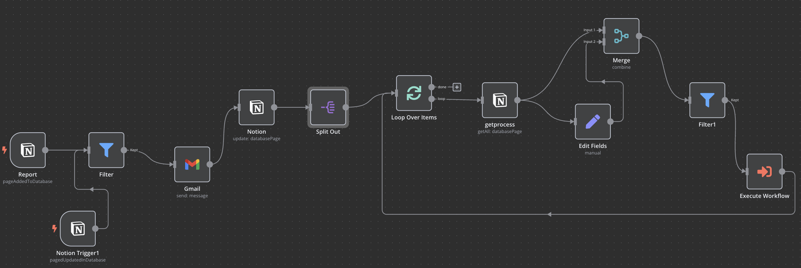
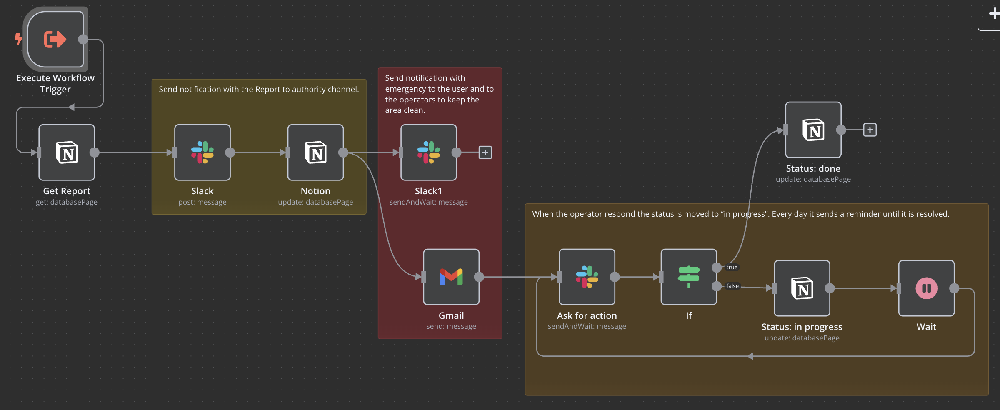
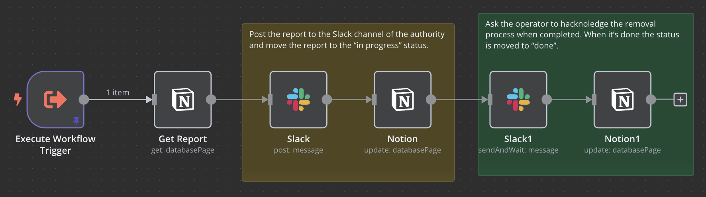
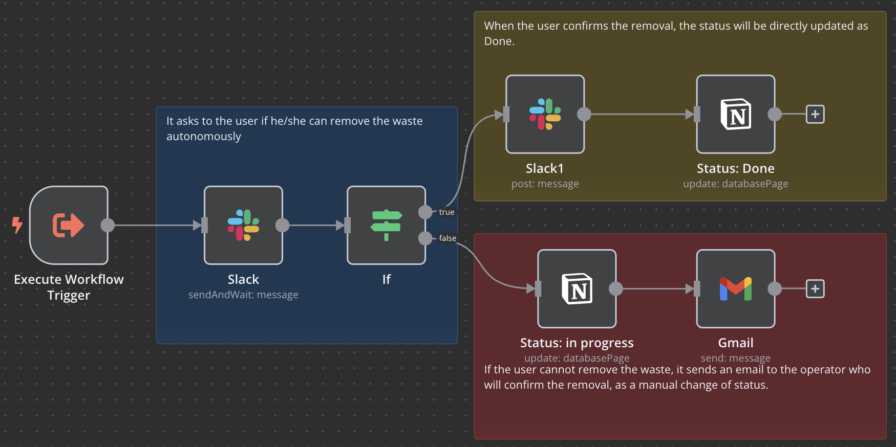

## COBOL CS

In the **COBOL CS**, the information system is used by both the citizens and public administration to report waste sites and manage the removal process. Indeed, the list of reported waste sites is grouped by status (see **(b)** in the [Figure](https://github.com/MT91/Low-code-Process-Digital-Twins/blob/main/COBOL_CS/CAISE 2025 (2)-4.pdf) ). Each report is also reported on a map-based view **(c)**. 
-4.pdf)
In this case study, depending on the type of waste, the system must trigger a different process for removal with a specific workflow. For this reason, we created a Notion database to map the type of waste to the ID of a process corresponding to a workflow in N8N that will be triggered. 
In the following [Figure](cobol-meta.png) we reported the meta workflow in charge of calling the right sub-workflow for the specific type of waste.

The asbestos material has a corresponding workflow reported in the following [Figure](cobol-asbestos.png). This workflow includes several status changes since the removal process of this type of waste is quite complex. For instance, when the report is validated by the public administrator, an *health emergency notified* status is used to inform the local health department of the possibility of respiratory problems in case of an invalid removal process. We also used Slack to simulate a real-time notification, and a video demo can be watched at this [link](https://youtu.be/DGcxz1zb-5A).

Also, in this case, the system interleaves the status changes directed by humans and by the system acting autonomously and reflecting the real-world process. A dashboard, reported in **(a)**, shows the number of reports by waste type on the left, whereas on the right, it shows the number of reports by date. 

In the following, we reported also other two sub-workflow modeling the removal process of [plastic](cobol-plastic.png) and [paper](cobol-paper.png) waste correspondingly.
 

