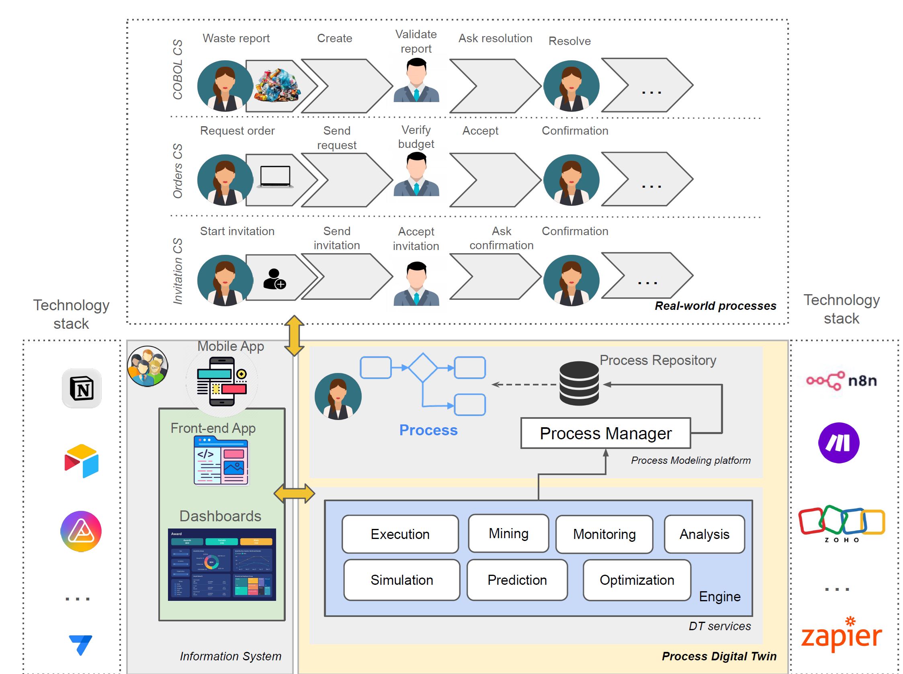

# How Low-code Platforms Support Process Digital Twins
This repository contains the supporting materials for the manuscript titled *"How Low-code Platforms Support Process Digital Twins: an Exploratory Paper"*, currently under submission to the *37th International Conferences on Advanced Information Systems Engineering (CAiSE 2025)*. 

These materials are provided to enable further exploration of the three case studies (CSs) requiring the implementation of real-world processes, each regarding a different application domain and problem.

## Abstract of the Study
Process Digital Twins (PDTs) are emerging as a feasible solution for modeling, monitoring, and optimizing business processes by providing real-time, data-driven insights into operational workflows. However, designing, developing, and maintaining PDTs can be complex and resource-intensive, often requiring highly specialized expertise in software engineering and domain-specific processes. 
In this paper, we propose leveraging low-code development platforms (LCDPs) to simplify and accelerate the creation and deployment of PDTs utilizing the intuitive, visual development environments and pre-built components they provide.
To evaluate the suitability of  LCDPs for supporting PDTs, we conducted a literature study identifying 11 key characteristics that define PDTs. Using these 11 characteristics as a foundational framework, we analyzed whether LCDPs can effectively support the design, development, and execution of PDTs. We applied this framework in three different case studies,
examining how LCDPs meet the requirements for PDT implementation across various scenarios. Our findings highlight the ease of adoption and cost-efficiency offered by LCDPs but reveal challenges.

## Main Characteristics of Process Digital Twins
To identify the main characteristics of PDTs, we performed a simplified literature review on the Scopus database, focusing on studies about the DT concept applied to processes from the start of the DT concept (1990) until 2024. Our Research Question aimed at identifying *the key characteristics required for the proper development of Process Digital Twin*. The protocol we followed, including the inclusion and exclusion criteria applied, is available at the following [Excel file](literature-review/Literature%20Review%20-%20Process%20Digital%20Twin.xlsx). From the set of papers analyzed, we synthesized the discovered knowledge in eleven fundamental characteristics that a framework for developing PDTs is highly desirable to support.

## Proposed Reference Architecture
Figure proposes a reference architecture for supporting the implementation of PDTs with a generic low-code development approach and without engineering custom solutions.  On top of Figure, we represented three real-world processes from our case studies that could benefit from a PDT implementation.

The architecture, consistent with the DT five-dimensional architecture [[1]](#1), consists of three core components: the real-world processes, the digital counterpart that mirrors and analyzes these processes, and the user-facing front end. Within this architecture, the digital counterpart continuously synchronizes with real-world processes, running analysis routines to provide real-time insights and feedback. This bidirectional synchronization creates a closed-loop system where insights and decisions generated in the digital counterpart can dynamically influence and optimize real-world processes, such as triggering automated adjustments, issuing operational alerts, or guiding human actions. The user front end serves as an interface for monitoring, controlling, and interacting with the PDT.

## Case studies
We propose three case studies (CSs) requiring the implementation of real-world processes, each regarding a different application domain and problem.

- **[Invitation_CS](https://github.com/MT91/Low-code-Process-Digital-Twins/tree/main/Invitation_CS)** folder: Implementation of the Guest Invitation system CS.
- **[Orders_CS](https://github.com/MT91/Low-code-Process-Digital-Twins/tree/main/Order_CS)** folder: Implementation of the Orders management system CS.
- **[COBOL_CS](https://github.com/MT91/Low-code-Process-Digital-Twins/tree/main/COBOL_CS)** folder: Implementation of the COBOL project CS.

## Authors
- Amleto Di Salle, Arianna Fedeli, Ludovico Iovino, Luciana Rebelo - Gran Sasso Science Institute, L'Aquila (Italy)
- Leonardo Mariani, Daniela Micucci, and Maria Teresa Rossi - University of Milano-Bicocca, Milan (Italy)

## References
1. Qi, Q., Tao, F., Hu, T., Anwer, N., Liu, A., Wei, Y., Wang, L., Nee, A.: Enabling technologies and tools for digital twin. Journal of Manufacturing Systems 58, 3–21 (2021). https://doi.org/https://doi.org/10.1016/j.jmsy.2019.10.001, digital Twin towards Smart Manufacturing and Industry 4.0
